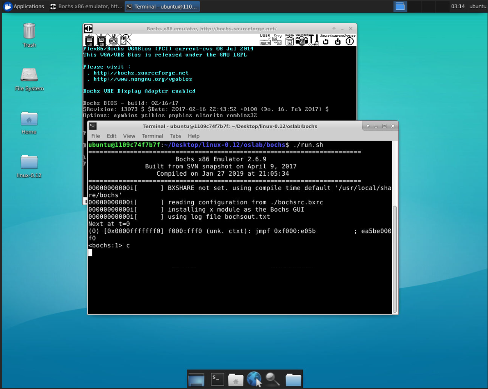

# 实验环境搭建及说明

## 一、环境搭建

- 编译环境要求: gcc-3.4
- 运行环境: bochs模拟器

### ubuntu(64bit>=14.04)

ubuntu用户可以使用`src/setup`目录下的一键搭建脚本[setup.sh](src/setup/setup.sh)。

选项说明：

- `-e` &emsp;安装编译环境(gcc-3.4，bin86等)
- `-b` &emsp;安装bochs模拟器
- `-bm` &emsp;下载和编译bochs源码，生成bochs模拟器(一般用不到)
    
    - `-g` &emsp;编译生成带gdb调试的bochs模拟器，例： ```./setup.sh -bm -g```

        注: bochs编译出错，主要由没有安装X windows开发环境或相关库文件造成。

### 其他系统(ubuntu也适用)

其他系统的用户可以选择已创建好的docker镜像作为实验环境(已安装gcc-3.4编译环境以及bochs模拟器)。docker安装过程不再描述，支持mac，windows，linux。

1. 首先从docker hub中拉取镜像;

    ```shell
    docker pull ultraji/ubuntu-xfce-novnc:os_learn 
    ```

2. 运行容器, 例如将本地项目`home`目录下`linux-0.12`挂载到ubuntu用户的桌面下(不建议在windows挂载，windows不区分文件大小写); 

    ```shell
    docker run -t -i -p 6080:6080 -v /home/ultraji/linux-0.12:/home/ubuntu/Desktop/linux-0.12 ultraji/ubuntu-xfce-novnc:os_learn
    ```

3. 默认不启动VNC服务, 运行`home/ubuntu`目录下`vnc_startup.sh`脚本启动VNC服务。开启vncserver后就可以通过浏览器输入```http://localhost:6080/vnc.html```访问桌面系统了。

    - vnc登陆密码: 123456
    - 默认用户: ubuntu
    - 用户密码: 123456

<div align=center>
 
</div>


## 二、如何使用

该项目的oslab为实验目录， 运行该目录下的`run.sh`脚本即可运行实验环境。

选项：

- `-m` &emsp;编译生成新的Image镜像
- `-g` &emsp;运行bochs模拟器，与gdb联调