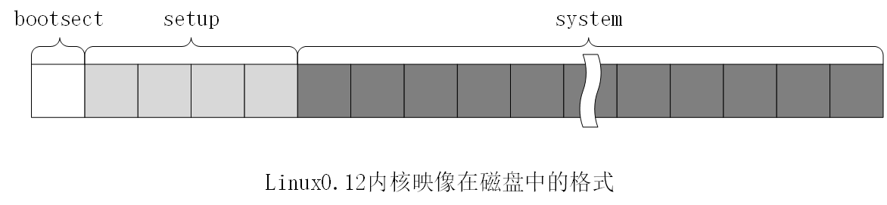

# 建造工具 build 的说明

生成build的源代码文件在```tools```目录下，该文件将被独立编译成一个可执行文件，只参与将bootsect、setup、system三个文件组合成一个映像文件Imgae，不会被包含到Imgae中，因此可以拿出来单独分析。该执行文件在主目录下的Makefile中被使用，通过以下以下命令生成映像文件Image。

```
tools/build boot/bootsect boot/setup tools/system $(ROOT_DEV) \$(SWAP_DEV) > Image
```

linux0.12内核映像如下所示：

<div align=center>
     
    <p>Image = bootsect(1) + setup(4) + system(...)</p>
</div>

组成Image的三个文件的说明(了解即可)：

1. bootsect = 32B的MINIX执行文件头结构 + 512B的代码和数据

2. setup = 32B的MINIX执行文件头结构 + 剩余部分的代码和数据

3. system = 1KB的a.out头结构 + 剩余部分的代码和数据

> 注意：所有头结构都是不需要的，需要去除掉。

build程序具体做了以下一些事(这里的扇区以1为第一个扇区)：

1. 将读取根设备号和交换设备号写入Image中的第1个扇区(bootsect)的506、507、508、509字节处；

2. 将bootsect的代码和数据写入Image中的第1个扇区(校验头部并去除MINIX执行文件头部(32B))；

3. 将setup的代码和数据写入Image中的第2~5个扇区(校验头部并去除MINIX执行文件头部(32B))；

4. 将system的代码和数据写入Image中的setup之后的扇区(校验头部并去除a.out格式头部(1KB))。