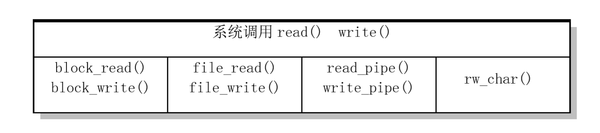

# write和read的实现

**相关文件：block_dev.c、file_dev.c、char_dev.c、pipe.c、read_write.c**

例如，库函数write通过调用syscall，使用__NR_write，进入内核态，进而在内核态下执行sys_write()。

如上图所示，sys_write()执行过程中，会根据文件类型执行相应的写操作；

- block_dev.c 提供了读写块设备特殊文件的block_read()和block_write()；
- file_dev.c 提供了用于访问一般的正规文件的file_read()和file_write()；
- pipe.c 实现了管道读写函数的read_pipe()和 write_pipe()；
- char_dev.c 实现了字符设备包括控制台终端（tty）、串口终端(ttyx)和内存字符设备的读写rw_char()；

**抠细节**

char_dev.c中rw_char()的实现相对比较复杂；首先，该文件定义了字符设备读写函数指针表crw_table；每当调用rw_char()时，该函数都会获取设备的主设备号，然后根据主设备号在字符设备读写函数指针表查找相应的读写函数，进行相应字符设备的操作。