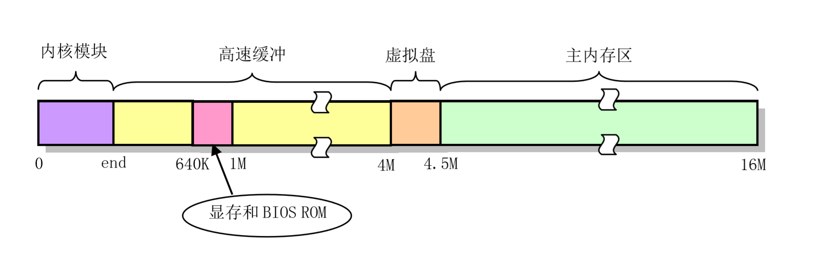
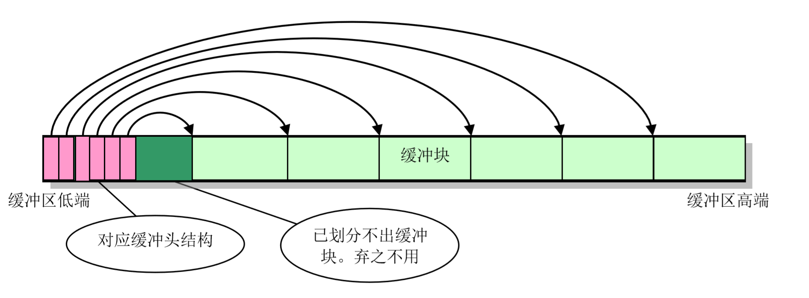
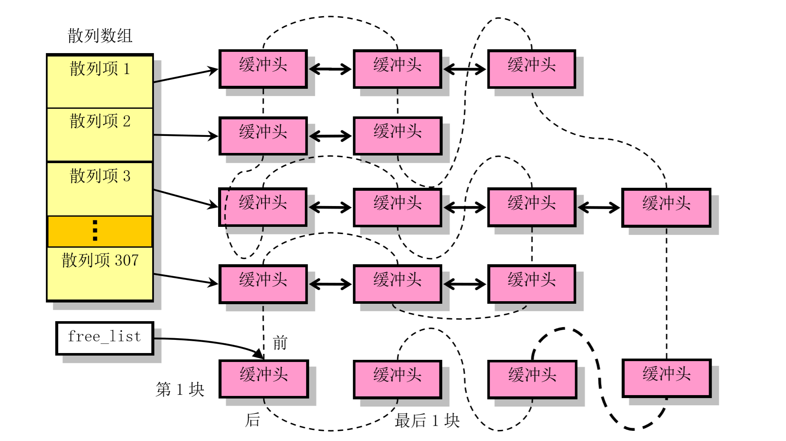
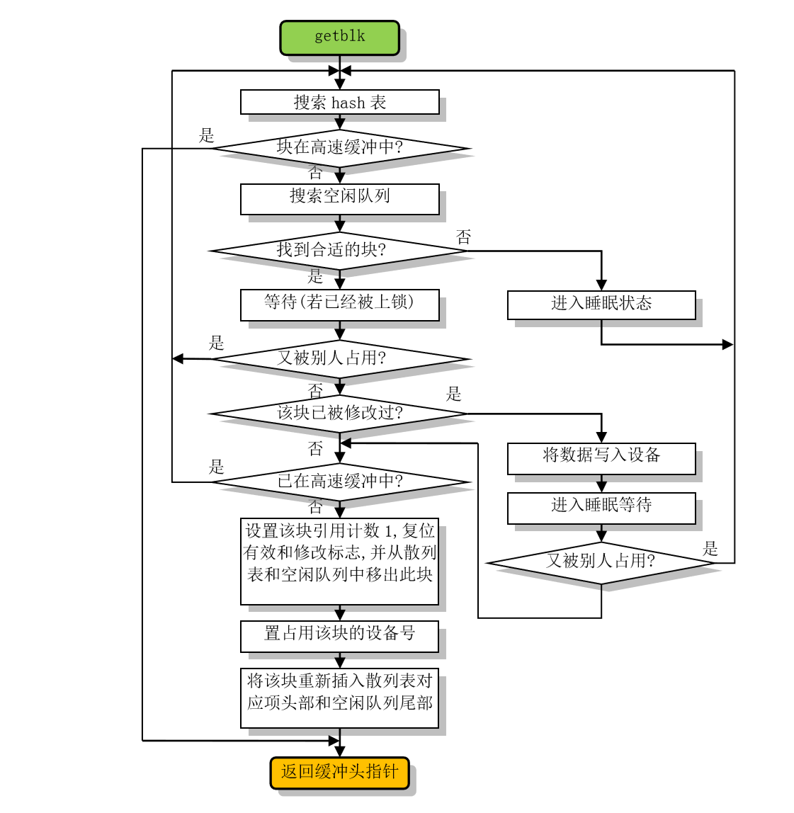

# 高速缓冲区的实现

**相关文件：buffer.c**

在linux-0.12中，内核程序不能直接操作访问块设备中的数据，而是需要通过操作物理内存中的高速缓冲区的数据（块设备中的数据拷贝）来间接地进行。

## linux-0.12对物理内存的分配

以物理内存大小为16M举例，高速缓冲区处于内核代码结束的位置end，到物理内存4M处（但中间从640K～1M会用于显存和BIOS ROM，初始化时需要跳过）。



## 高速缓冲区的数据结构

高速缓冲区的结构，实际上是指高速缓冲区头部的结构，对高速缓冲区的操作，实际上是对缓冲头的操作。

```c
/* 缓冲头的数据结构 */
struct buffer_head {
	char * b_data;                      /* 指向缓冲数据块的指针 */
	unsigned long b_blocknr;            /* 块号 */
	unsigned short b_dev;               /* 数据源的设备号 */
	unsigned char b_uptodate;           /* 更新标志：表示数据是否已更新 */
	unsigned char b_dirt;               /* 修改标志：0未修改，1已修改 */
	unsigned char b_count;              /* 使用用户数 */
	unsigned char b_lock;               /* 缓冲区是否被锁定 0 - ok, 1 -locked */	
	struct task_struct * b_wait;        /* 指向等待该缓冲区解锁的任务 */

	/* 这四个指针用于缓冲区的管理 */
	struct buffer_head * b_prev;        /* hash队列上的前一块 */
	struct buffer_head * b_next;        /* hash队列上的后一块 */
	struct buffer_head * b_prev_free;   /* 空闲表上的前一块 */
	struct buffer_head * b_next_free;   /* 空闲表上的后一块 */
};
```

## 高速缓冲区的初始化

高速缓冲区占用的物理内存（黄色区域）在初始化过程中（`buffer_init`），内存低端会被初始化成缓冲头`buffer_head`，内存高端为缓冲块(大小1024B)。并且`buffer_head`中的`b_data`会指向对应的缓冲块。



同时在初始化过程中，会初始化缓冲头中的四个重要的指针`b_prev`、`b_next`、`h->b_prev_free`和`h->b_next_free`。

所有缓冲头会通过`h->b_prev_free`和`h->b_next_free`被链接成一个双向链表结构，称为空闲链表`free_list`。**在系统的运行过程中，所有缓冲头始终都会在空闲链表上**。

其中`b_prev`、`b_next`指针用于hash表中散列在同一项上多个缓冲块之间的双向链接，会暂时被初始化为NULL，即不处于任何一个hash表项中。

系统运行某个时刻的高速缓冲区分配如下图所示：



## 高速缓冲区的操作

`buffer.c`中主要实现了`bread`（从设备中读取指定块到缓冲区）、`breada`（从设备中读取指定块到缓冲区，并预先读取一些块）、`bread_page`（从设备中读取一页到缓冲区）、`brelse`（释放指定缓冲块）、`getblk`（取高速缓冲中指定的缓冲块）等函数，其中`getblk`比较难理解。


### getblk的实现

`getblk`之所以这么复杂，是为了避免竞争导致出错，`getblk`的流程图如下：



1. 从hash表中获得的缓冲块，是直接可用的，故直接返回；
2. 搜索空闲列表的过程比较繁琐（搜索过程从表头开始，搜索没被使用（count=0）且（b_dirt<<1+b_lock）最小的块）：
    1. 没有空闲块可以用（所有count!=0），回到第1步重来；
    2. 找到的空闲块是上锁状态，睡眠等待解锁，唤醒时发现该块又被别人占用了，回到第1步重来；
    3. 找到的空闲块被修改过，睡眠等待写回，唤醒时发现该块又被别人占用了，回到第1步重来；
    4. 因为之前几步可能有睡眠动作，如果在该进程睡眠过程中，别的进程申请了该块，并放到高速缓冲区中，该进程再从空闲块中申请的话会导致一个设备块对应多个缓冲块，这是不允许的，所以需要判断是否在高速缓冲区中，如果发现存在，回到第1步重来；

**抠细节**：

- 最理想的情况是找到一个完全空闲的缓冲块，即b_dirt和b_lock标志均为0的缓冲块；但是如果不能满足这两个条件，那么就需要根据b_dirt和b_lock标志计算出一个值。因为设备操作通常很耗时，所以在计算时需加大b_dirt的权重。

- `getblk`在最后几步获得缓冲块后会先从空闲表中移出该块的缓冲头结构，在设置了该缓冲块所属的设备号和相应的逻辑号后，再将其插入hash表对应表项首部并链接到空闲队列的末尾处。由于搜索空闲块是从空闲队列头开始的，因此这种先从空闲队列中移出并使用最近不常用的缓冲块，然后再重新插入到空闲队列尾部的操作也就实现了**最近最少使用LRU算法**。

### 其他主要函数的说明

- `getblk(int dev, int block)`获得指定缓冲块的时候，如果从空闲队列中获取，会将count置1；

- `brelse(struct buffer_head * buf)`会释放指定的缓冲块，只是简单地将count减1，然后唤醒等待该块的进程；

- `bread(int dev, int block)`先通过getblk获取指定缓冲块，如果b_uptodate有效，则返回，否则从设备中读取有效数据后返回；

- `breada(int dev, int first, ...)`会获取指定的第一块和之后几块的缓冲块，并读入数据，但是只有第一块是占用的（count=1）,之后几块的会释放占用状态（count=0）；

- `bread_page(unsigned long address, int dev, int b[4])` 读取设备的一个页面的内容到指定内存地址处，该函数仅用于mm/memory.c文件的do_no_page()函数中（缺页时的操作）；