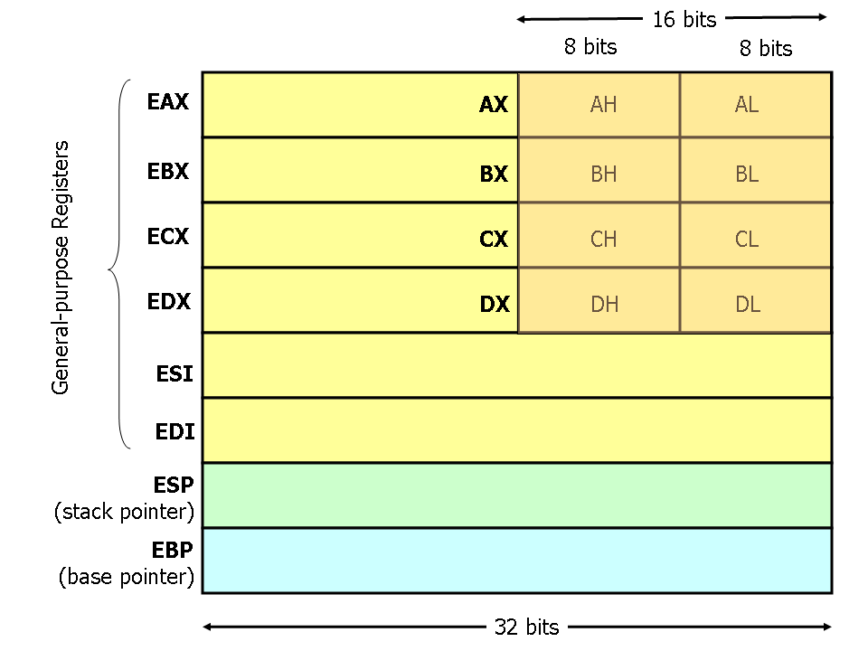

# 汇编中各寄存器的作用 

- 4个数据寄存器(`EAX`、`EBX`、`ECX`、`EDX`)
- 6个段寄存器(`ES`、`CS`、`SS`、`DS`、`FS`、`GS`)
- 2个变址寄存器(`ESI`、`EDI`) 
- 2个指针寄存器(`ESP`、`EBP`)
- 1个指令指针寄存器(`EIP`) 1个标志寄存器(`EFlags`)

## 数据寄存器

 

数据寄存器主要用来保存操作数和运算结果等信息，从而节省读取操作数所需占用总线和访问存储器的时间。32位CPU有4个32位的通用寄存器`EAX`、`EBX`、`ECX`和`EDX`。这些低16位寄存器分别命名为：`AX`、`BX`、`CX`和`DX`，它和先前的CPU中的寄存器相一致。4个16位寄存器又可分割成8个独立的8位寄存器(`AX`：`AH`-`AL`、`BX`：`BH`-`BL`、`CX`：`CH`-`CL`、`DX`：`DH`-`DL`)，可独立存取。

- `AX` 通常称为累加器(Accumulator)，用累加器进行的操作可能需要更少时间。累加器可用于乘、 除、输入/输出等操作，它们的使用频率很高

- `BX` 称为基地址寄存器(Base Register)，它可作为存储器指针来使用

- `CX` 称为计数寄存器(Count Register)，在循环和字符串操作时，要用它来控制循环次数；在位操作中，当移多位时，要用CL来指明移位的位数

- `DX` 称为数据寄存器(Data Register)，在进行乘、除运算时，它可作为默认的操作数参与运算，也可用于存放I/O的端口地址

在16位CPU中，`AX`、`BX`、`CX`和`DX`不能作为基址和变址寄存器来存放存储单元的地址，但在32位CPU中，其32位寄存器`EAX`、`EBX`、`ECX`和`EDX`不仅可传送数据、暂存数据保存算术逻辑运算结果，而且也可作为指针寄存器，所以，这些32位寄存器更具有通用性。

## 变址寄存器

32位CPU有2个32位通用寄存器`ESI`和`EDI`。其低16位对应先前CPU中的`SI`和`DI`。

寄存器`ESI`、`EDI`、`SI`和`DI`称为变址寄存器(Index Register)，它们主要用于存放存储单元在段内的偏移量，用它们可实现多种存储器操作数的寻址方式，为以不同的地址形式访问存储单元提供方便。作为通用寄存器，也可存储算术逻辑运算的操作数和运算结果。它们可作一般的存储器指针使用。在字符串操作指令的执行过程中，对它们有特定的要求，而且还具有特殊的功能。

## 指针寄存器

32位CPU有2个32位通用寄存器`EBP`和`ESP`。其低16位对应先前CPU中的`BP`和`SP`。

寄存器`EBP`、`ESP`、`BP`和`SP`称为指针寄存器(Pointer Register)，主要用于存放堆栈内存储单元的偏移量，用它们可实现多种存储器操作数的寻址方式，为以不同的地址形式访问存储单元提供方便。作为通用寄存器，也可存储算术逻辑运算的操作数和运算结果。它们主要用于访问堆栈内的存储单元，并且规定：

- `BP` 为基指针寄存器(Base Pointer)，用它可直接存取堆栈中的数据
- `SP` 为堆栈指针寄存器(Stack Pointer)，用它只可访问栈顶

## 段寄存器

段寄存器是根据内存分段的管理模式而设置的。内存单元的物理地址由段寄存器的值和一个偏移量组合而成的，这样可用两个较少位数的值组合成一个可访问较大物理空间的内存地址。

CPU内部的段寄存器：
- `CS` 代码段寄存器(Code Segment Register)，其值为代码段的段值
- `DS` 数据段寄存器(Data Segment Register)，其值为数据段的段值
- `ES` 附加段寄存器(Extra Segment Register)，其值为附加数据段的段值
- `FS` 附加段寄存器(Extra Segment Register)，其值为附加数据段的段值
- `SS` 堆栈段寄存器(Stack Segment Register)，其值为堆栈段的段值
- `GS` 附加段寄存器(Extra Segment Register)，其值为附加数据段的段值

在16位CPU系统中，它只有4个段寄存器，所以，程序在任何时刻至多有4个正在使用的段可直接访问；在32位微机系统中，它有6个段寄存器，所以，在此环境下开发的程序最多可同时访问6个段。32位CPU有两个不同的工作方式：实方式和保护方式。在每种方式下，段寄存器的作用是不同的。有关规定简单描述如下：
- 实方式： 前4个段寄存器`CS`、`DS`、`ES`和`SS`与先前CPU中的所对应的段寄存器的含义完全一致，内存单元的逻辑地址仍为“段值：偏移量”的形式。为访问某内存段内的数据，必须使用该段寄存器和存储单元的偏移量。
-  保护方式： 在此方式下，情况要复杂得多，装入段寄存器的不再是段值，而是称为Selector的某个值。

## 指令指针寄存器

32位CPU把指令指针扩展到32位，并记作`EIP`，`EIP`的低16位与先前CPU中的`IP`作用相同。
指令指针`EIP`、`IP`(Instruction Pointer)是存放下次将要执行的指令在代码段的偏移量。在具有预取指令功能的系统中，下次要执行的指令通常已被预取到指令队列中，除非发生转移情况。所以，在理解它们的功能时，不考虑存在指令队列的情况。在实方式下，由于每个段的最大范围为64K，所以，`EIP`中的高16位肯定都为0，此时，相当于只用其低16位的`IP`来反映程序中指令的执行次序。

## 标志寄存器

### 一、运算结果标志位

1. `CF` 进位标志(Carry Flag)

    进位标志`CF`主要用来反映运算是否产生进位或借位。如果运算结果的最高位产生了一个进位或借位，那么，其值为1，否则其值为0。使用该标志位的情况有：多字(字节)数的加减运算，无符号数的大小比较运算，移位操作，字(字节)之间移位，专门改变`CF`值的指令等。

2. `PF` 奇偶标志(Parity Flag)

    奇偶标志`PF`用于反映运算结果中“1”的个数的奇偶性。如果“1”的个数为偶数，则`PF`的值为1，否则其值为0。利用`PF`可进行奇偶校验检查，或产生奇偶校验位。在数据传送过程中，为了提供传送的可靠性，如果采用奇偶校验的方法，就可使用该标志位。

3. `AF` 辅助进位标志(Auxiliary Carry Flag)

    在发生下列情况时，辅助进位标志`AF`的值被置为1，否则其值为0：
    
    1. 在字操作时，发生低字节向高字节进位或借位时；
    2. 在字节操作时，发生低4位向高4位进位或借位时。

4. `ZF` 零标志(Zero Flag)

    零标志`ZF`用来反映运算结果是否为0。如果运算结果为0，则其值为1，否则其值为0。在判断运算结果是否为0时，可使用此标志位。

5. `SF` 符号标志(Sign Flag)

    符号标志`SF`用来反映运算结果的符号位，它与运算结果的最高位相同。在微机系统中，有符号数采用补码表示法，所以，`SF`也就反映运算结果的正负号。运算结果为正数时，`SF`的值为0，否则其值为1。

6. `OF` 溢出标志(Overflow Flag)
溢出标志`OF`用于反映有符号数加减运算所得结果是否溢出。如果运算结果超过当前运算位数所能表示的范围，则称为溢出，`OF`的值被置为1，否则，`OF`的值被清为0。“溢出”和“进位”是两个不同含义的概念，不要混淆。

对以上6个运算结果标志位，在一般编程情况下，标志位`CF`、`ZF`、`SF`和`OF`的使用频率较高，而标志位`PF`和`AF`的使用频率较低。

### 二、状态控制标志位

状态控制标志位是用来控制CPU操作的，它们要通过专门的指令才能使之发生改变。

1. `TF` 追踪标志(Trap Flag)

    当追踪标志`TF`被置为1时，CPU进入单步执行方式，即每执行一条指令，产生一个单步中断请求。这种方式主要用于程序的调试。指令系统中没有专门的指令来改变标志位TF的值，但程序员可用其它办法来改变其值。

2. `IF` 中断允许标志(Interrupt-enable Flag)

    中断允许标志`IF`是用来决定CPU是否响应CPU外部的可屏蔽中断发出的中断请求。但不管该标志为何值，CPU都必须响应CPU外部的不可屏蔽中断所发出的中断请求，以及CPU内部产生的中断请求。具体规定如下：

    1. 当`IF`=1时，CPU可以响应CPU外部的可屏蔽中断发出的中断请求；
    2. 当`IF`=0时，CPU不响应CPU外部的可屏蔽中断发出的中断请求。
    
    CPU的指令系统中也有专门的指令来改变标志位`IF`的值。

3. `DF` 方向标志(Direction Flag)
    
    方向标志`DF`用来决定在串操作指令执行时有关指针寄存器发生调整的方向。在微机的指令系统中，还提供了专门的指令来改变标志位`DF`的值。

### 三、32位标志寄存器增加的标志位

1. `IOPL` I/O特权标志(I/O Privilege Level)

    I/O特权标志用两位二进制位来表示，也称为I/O特权级字段。该字段指定了要求执行I/O指令的特权级。如果当前的特权级别在数值上小于等于`IOPL`的值，那么，该I/O指令可执行，否则将发生一个保护异常。

2. `NT` 嵌套任务标志(Nested Task)

    嵌套任务标志`NT`用来控制中断返回指令IRET的执行。具体规定如下：
    
    1. 当`NT`=0，用堆栈中保存的值恢复`EFLAGS`、`CS`和`EIP`，执行常规的中断返回操作；
    2. 当`NT`=1，通过任务转换实现中断返回。

3. `RF` 重启动标志(Restart Flag)

    重启动标志RF用来控制是否接受调试故障。规定：`RF`=0时，表示“接受”调试故障，否则拒绝之。在成功执行完一条指令后，处理机把RF置为0，当接受到一个非调试故障时，处理机就把它置为1。

4. `VM` 虚拟8086方式标志(Virtual 8086 Mode)

    如果该标志的值为1，则表示处理机处于虚拟的8086方式下的工作状态，否则，处理机处于一般保护方式下的工作状态。